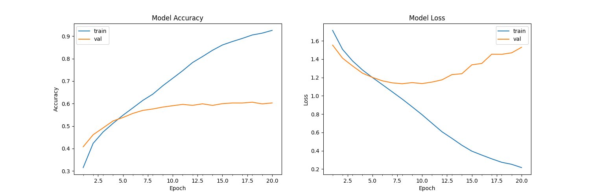

# EmotioNN

This project was created to classify emotions on a person's face into one of **seven categories** using a convolutional
neural network. The model is trained on the **FER-2013** dataset published on the Kaggle competition. This dataset
consists of 35887 48x48 grayscale face images tagged with **seven** emotions: angry, disgusted, fearful, happy, neutral,
sad and surprised.

## Dependencies

* [OpenCV](https://opencv.org/), [Tensorflow](https://www.tensorflow.org/)

## Structure

* `data` (folder, it creates when start `dataset_prepare` script)
* `emotionn` (package)
    * `dataset_prepare.py` (file, using to prepare data for FER-2013)
    * `emotion_recognition.py` (file, using to recognize a face from webcam)
* `model` (folder, contains model and weights files)

## Usage

The repository is compatible with **Tensorflow 2.0** and makes use of the Keras API using the `tensorflow.keras`
library.  
Firstly, you need to clone this repository

### Train

* Download the FER-2013 dataset
  from [here](https://www.kaggle.com/c/challenges-in-representation-learning-facial-expression-recognition-challenge/data)
* If you want to train this model, use:

```bash
python emotionn/recognition.py --mode train
```

### Recognize

* To view the predictions without training again, you can download the pre-trained model from [here]() and then run:

```bash
python emotionn/recognition.py --mode display
```

## Data preparation

1. Convert images into a dataset of images in the PNG format for training/testing and provided this as the dataset in
   the previous section.
2. In case you are looking to experiment with new datasets, you may have to deal with data in the csv format. I have
   provided the code I wrote for data preprocessing in the dataset_prepare.py file which can be used for reference.

## Algorithm

1. First, the **haar cascade** method used to detect faces in each frame of the webcam feed.
2. The region of image containing the face is resized to **48x48** and passed as input to the CNN.
3. The network outputs looks like a list of **softmax scores** for the seven classes of emotions.
4. The emotion with maximum score is displaying on the screen.

This implementation by default detects emotions on all faces in the webcam feed. With a simple 2-layer CNN, the test
accuracy reached 61.2% in 20 epochs.
